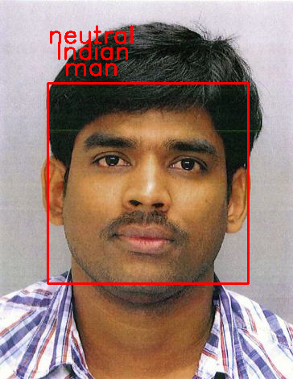
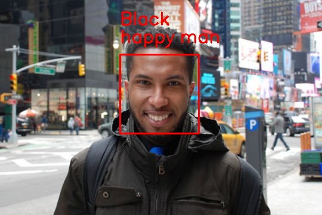

# Project Title

This Project Aims to develop face analytics models (CNN based models). Current project has models to estimate following information.

Ethinicity - Detects ethinicity from face with four classes as  [ Asian, Indian, Black, White]
Gender- Detects human gender [Man , Woman]
Emotion - Detects seven different facial emotions such as ['angry', 'disgust', 'fear', 'happy', 'sad','surprise', 'neutral'] 

## Quick Run

To test the output on new image siply run

"python Api.py TEST_IMAGE_PATH PATH_TO_SAVE_OUTPUT"

Api saves the the image at PATH_TO_SAVE_OUTPUT with bounding box drawn around the detected face with detected Ethinicity, Gender and Emotion 

### Installing

Simply clone the Repo. Project is built with python 2.7 and NOT tested with python 3

### Output 

Some Test case results are shown below

## Trained-Models

Trained models are available in folder "trained_models". All models are trained with carefully designed CNN models.
Ethinicity/ race detection model uses the transfer learning approach

Contact developer for training scripts.

## Versioning

We use [SemVer](http://semver.org/) for versioning. For the versions available, see the [tags on this repository](https://github.com/your/project/tags). 

## Authors

* **Rupesh Wadibhasme** - 

